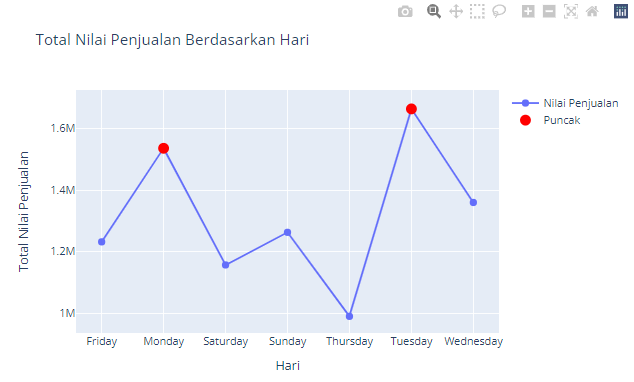
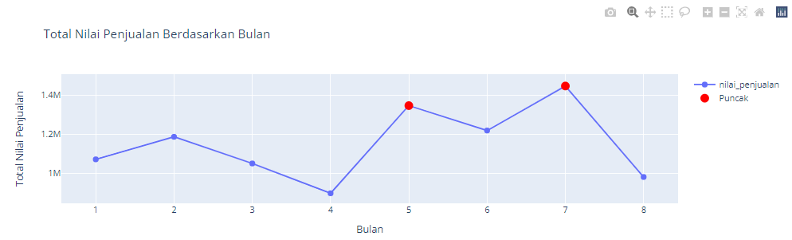
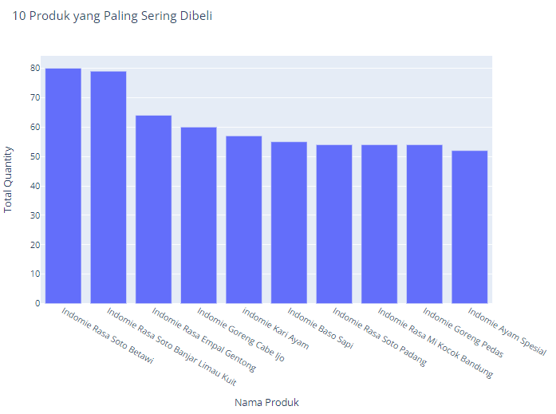
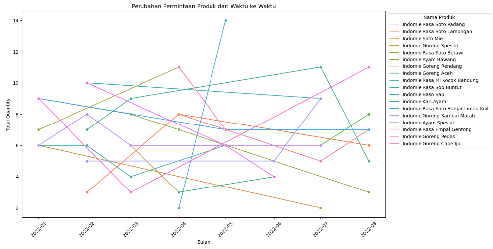
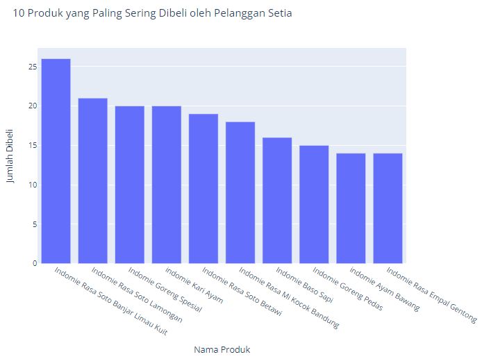
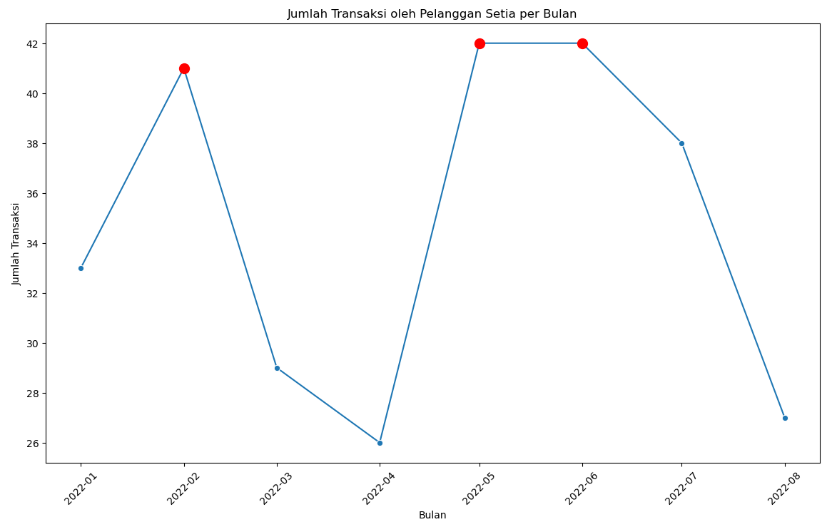

# Business Understanding

## Latar Belakang

Warmindo, kependekan dari Warung Makan Indomie, adalah salah satu jenis usaha kuliner yang sangat populer di Indonesia. Warung ini menawarkan berbagai macam produk berbasis mi instan dan menu sederhana lainnya yang digemari oleh berbagai kalangan. Untuk memahami dan mengoptimalkan operasional bisnis, penting bagi Warmindo untuk menganalisis data transaksi yang terjadi di warung mereka.

### Tujuan Analisis

Analisis data transaksi dari dataset data_warmindo.csv memiliki beberapa tujuan utama:

1. Mengidentifikasi Pola Pembelian Pelanggan
    - Menganalisis kapan (tanggal dan waktu) transaksi terjadi untuk mengetahui jam sibuk dan periode waktu dengan penjualan tertinggi.
    - Melihat produk apa yang paling sering dibeli dan bagaimana permintaan produk berubah dari waktu ke waktu.
    - Siapa pelanggan setia dan bagaimana kita bisa meningkatkan loyalitas mereka?
    - Bagaimana harga jual rata-rata mempengaruhi jumlah penjualan dan total pendapatan?

2. Segmentasi Pelanggan
    - Mengelompokkan pelanggan berdasarkan pola pembelian mereka, seperti frekuensi pembelian, jenis produk yang dibeli, dan nilai penjualan.
    - Mengetahui siapa pelanggan setia dan pelanggan yang jarang berbelanja.

3. Optimasi Stok dan Inventaris
    - Menggunakan data penjualan untuk memperkirakan kebutuhan stok produk.
    - Mengurangi risiko kekurangan stok atau overstocking yang dapat mengurangi profitabilitas.

4. Evaluasi Promosi dan Diskon
    - Menganalisis efektivitas berbagai jenis promosi dan diskon yang diberikan kepada pelanggan.
    - Mengidentifikasi metode pembayaran mana yang paling sering digunakan oleh pelanggan dan apakah ada pengaruhnya terhadap nilai penjualan.

### Hasil yang Diharapkan

Dengan melakukan analisis mendalam terhadap data ini, Warmindo dapat mengambil keputusan bisnis yang lebih baik berdasarkan wawasan yang diperoleh. Hasil analisis diharapkan dapat membantu dalam:

- Mengoptimalkan strategi penjualan dan pemasaran.
- Memperbaiki manajemen inventaris dan rantai pasokan.
- Meningkatkan kepuasan dan loyalitas pelanggan melalui layanan yang lebih baik dan penawaran yang disesuaikan dengan kebutuhan pelanggan.

# Data Understanding

- **Koleksi Data:** Dataset data_warmindo.csv dengan 499 rows dengan kolom id, invoice_id, tanggal_transaksi, customer_id, nama_produk, jenis_produk, kategori_produk, quantity, harga_jual, jenis_pembayaran, jenis_pesanan, nilai_penjualan. Dari masing-masing kolom ini memiliki penjelasan sebagai berikut:

    - id: ID unik untuk setiap entri transaksi.
    - invoice_id: ID faktur untuk transaksi tertentu.
    - tanggal_transaksi: Tanggal transaksi terjadi.
    - customer_id: ID unik untuk setiap pelanggan.
    - nama_produk: Nama produk yang dibeli.
    - jenis_produk: Jenis produk (misalnya, mi instan, minuman, dll.).
    - kategori_produk: Kategori produk (misalnya, makanan, minuman).
    - quantity: Jumlah produk yang dibeli.
    - harga_jual: Harga jual per unit produk.
    - jenis_pembayaran: Jenis pembayaran yang digunakan (misalnya, tunai, kartu kredit).
    - jenis_pesanan: Jenis pesanan (misalnya, makan di tempat, bawa pulang).
    - nilai_penjualan: Total nilai penjualan untuk transaksi tersebut.

- **Eksplorasi Data:**
    - Mengidentifikasi distribusi dan statistik deskriptif dari masing-masing kolom.
    - Mengamati pola temporal dari tanggal_transaksi.
    - Menggali hubungan antara nama_produk, jenis_produk, dan kategori_produk dengan nilai_penjualan.

# Data Preparation

- **Pembersihan Data:**
    - Mengisi atau menghapus data yang hilang.
    - Mengoreksi atau menghapus data anomali.

- **Transformasi Data:**
    - Mengubah format tanggal_transaksi menjadi datetime.
    - Mengelompokkan produk berdasarkan kategori_produk.
    - Menambahkan kolom baru jika diperlukan (misalnya, hari dalam minggu, bulan, dll).

- **Integrasi Data:**
    - Menggabungkan data yang mungkin terpisah (jika ada dataset tambahan).  

# Exploratory Data Analysis (EDA)

Pada tahapan analisa ini akan menjawab pertanyaan yang ada pada Business Understanding, berdasarkan pada data yang sudah dilakukan pengecekan dan proses cleaning pada tahap sebelumnya.

### 1. Menganalisis kapan (hari dan bulan) transaksi terjadi untuk mengetahui periode tanggal dan bulan dengan penjualan tertinggi

#### Penjualan Harian

1. Hari dengan Penjualan Tertinggi
    
    - Penjualan tertinggi terjadi pada hari Selasa dengan nilai penjualan sebesar Rp 1.664.000.
    - Penjualan pada hari Senin juga cukup tinggi, berada di posisi kedua dengan nilai Rp 1.536.000.
    
2. Hari dengan Penjualan Terendah
    
    - Penjualan terendah terjadi pada hari Kamis dengan nilai penjualan sebesar Rp 990.000.
    
3. Tren Penjualan Harian
    
    - Ada peningkatan yang signifikan pada nilai penjualan dari Jumat ke Senin, dengan lonjakan yang signifikan pada hari Senin.
    - Setelah mencapai puncak pada hari Senin, penjualan turun pada hari Sabtu dan terus menurun hingga mencapai titik terendah pada hari Kamis.
    - Penjualan kembali meningkat tajam pada hari Selasa, kemudian menurun kembali pada hari Rabu.
    
4. Polarisasi Penjualan
    
    - Hari-hari dengan penjualan tertinggi (Senin dan Selasa) tampak menonjol dibandingkan hari-hari lainnya, menunjukkan kemungkinan adanya faktor khusus pada hari-hari tersebut yang mendorong peningkatan penjualan, seperti promosi atau kebiasaan konsumen.
    - Sebaliknya, hari Kamis menunjukkan penurunan yang signifikan, yang mungkin memerlukan analisis lebih lanjut untuk memahami penyebab penjualan rendah.

#### Penjualan Bulanan

1. Fluktuasi Penjualan Bulanan
    
    - Penjualan mengalami fluktuasi signifikan dari bulan ke bulan. Dari Januari ke Februari, terjadi peningkatan penjualan dari Rp 1.072.000 menjadi Rp 1.187.000.
    - Penjualan kemudian menurun pada bulan Maret menjadi Rp 1.051.000 dan terus menurun hingga mencapai titik terendah pada bulan April dengan nilai penjualan sebesar Rp 899.000.
    
2. Pemulihan dan Puncak Penjualan
    
    - Setelah penurunan drastis pada bulan April, terjadi pemulihan signifikan pada bulan Mei dengan nilai penjualan mencapai Rp 1.346.000, menunjukkan adanya upaya yang berhasil dalam meningkatkan penjualan.
    - Puncak penjualan terjadi pada bulan Juli dengan nominal transaksi tertinggi sebesar Rp 1.446.000, menandakan bulan dengan performa terbaik sepanjang tahun ini.
    
3. Penurunan Pasca-Puncak
    
    - Setelah mencapai puncak pada bulan Juli, penjualan kembali menurun pada bulan Agustus dengan nilai transaksi sebesar Rp 982.000, namun penurunan ini tidak seburuk penurunan yang terjadi pada bulan April.

- - -

### 2. Melihat produk apa yang paling sering dibeli dan bagaimana permintaan produk berubah dari waktu ke waktu

#### Visualisasi 10 Produk yang Paling Sering Dibeli

1. Indomie Rasa Soto Betawi menjadi produk paling populer dengan penjualan mencapai 80 bungkus. Produk ini menempati peringkat pertama dalam daftar Top 10 produk yang paling sering dibeli.
2. Indomie Rasa Soto Banjar Limau Kuit berada di peringkat kedua dengan jumlah pembelian sebanyak 79 bungkus, hanya terpaut satu bungkus dari peringkat pertama. Hal ini menunjukkan persaingan yang sangat ketat antara kedua produk ini di pasar.
3. Di peringkat ketiga terdapat Indomie Rasa Empal Gentong dengan total pembelian sebanyak 64 bungkus. Meskipun berada di bawah kedua produk sebelumnya, jumlah penjualannya tetap signifikan dan menunjukkan popularitas yang tinggi.
4. Beberapa produk seperti Indomie Rasa Soto Padang, Indomie Rasa Mi Kocok Bandung, dan Indomie Goreng Pedas menunjukkan stabilitas dalam penjualan, dengan masing-masing mencapai sekitar 54 bungkus terjual. Stabilitas ini mencerminkan adanya permintaan yang konsisten dari konsumen untuk produk-produk tersebut.
5. Meskipun terdapat perbedaan jumlah penjualan yang cukup signifikan antara produk yang paling laris dengan produk lainnya dalam daftar Top 10, semua produk ini menunjukkan popularitas mereka di pasar Indomie. Hal ini mengindikasikan bahwa setiap produk memiliki basis pelanggan yang setia dan permintaan yang solid.

#### Visualisasi Perubahan Permintaan Produk dari Waktu ke Waktu

1. Indomie Kari Ayam

    - **Peningkatan Tajam:** Pada bulan April 2022, penjualan Indomie Kari Ayam hanya mencapai 2 bungkus. Namun, pada bulan Mei 2022, penjualan melonjak tajam hingga mencapai 14 bungkus. Lonjakan ini menandakan adanya peningkatan permintaan yang signifikan dalam waktu satu bulan.

2. Indomie Rasa Mi Kocok Bandung

    - **Fluktuasi Penjualan:** Produk ini menunjukkan peningkatan permintaan pada bulan Maret dan Juli 2022. Pada bulan Februari, penjualan hanya mencapai 7 bungkus, namun meningkat menjadi 9 bungkus pada bulan Maret dan mencapai 11 bungkus pada bulan Juli.
    - **Penurunan Setelah Peningkatan:** Setelah mencapai puncaknya pada bulan Juli, penjualan kembali menurun pada bulan Agustus dengan total penjualan sebanyak 5 bungkus. Hal ini menunjukkan adanya fluktuasi dalam permintaan untuk produk ini.

3. Indomie Goreng Pedas

    - **Penurunan Awal dan Pemulihan:** Pada bulan Januari 2022, penjualan Indomie Goreng Pedas mencapai 7 bungkus. Namun, penjualan menurun secara bertahap hingga hanya mencapai 3 bungkus pada bulan Maret 2022.
    - **Peningkatan Kembali:** Pada bulan Agustus 2022, penjualan produk ini meningkat signifikan hingga mencapai 11 bungkus. Ini menunjukkan adanya pemulihan permintaan setelah periode penurunan.

- - -

### 3. Siapa pelanggan setia dan bagaimana kita bisa meningkatkan loyalitas mereka?

#### Visualisasi 10 Produk yang Paling Sering Dibeli oleh Pelanggan Setia

1. Produk Teratas dan Preferensi Pelanggan

    - Indomie Rasa Soto Banjar Limau Kuit adalah produk paling populer dengan jumlah pembelian lebih dari 25 kali. Ini menunjukkan bahwa produk ini memiliki daya tarik yang sangat tinggi di antara pelanggan setia.
    - Produk lain yang juga populer termasuk Indomie Goreng Spesial dan Indomie Kari Ayam, masing-masing dengan sekitar 20 kali pembelian. Popularitas ini menunjukkan bahwa pelanggan setia menyukai variasi rasa yang berbeda.

2. Keragaman Rasa

    - Pelanggan setia tertarik pada berbagai rasa yang ditawarkan oleh Warmindo, seperti soto, kari, baso sapi, dan goreng pedas. Ini menunjukkan pentingnya menyediakan berbagai macam rasa untuk memenuhi selera pelanggan yang beragam.
    - Produk dengan variasi rasa seperti Indomie Rasa Soto Lamongan dan Indomie Rasa Soto Betawi juga menunjukkan jumlah pembelian yang signifikan, meskipun sedikit lebih rendah dibandingkan produk teratas.

3. Produk dengan Penjualan Lebih Rendah

    - Produk seperti Indomie Goreng Rasa Empal Gentong, Indomie Ayam Bawang, dan Indomie Goreng Pedas termasuk dalam 10 produk teratas, tetapi memiliki jumlah pembelian yang lebih rendah dibandingkan produk lainnya. Ini menunjukkan bahwa meskipun populer, ada ruang untuk peningkatan penjualan untuk produk-produk ini.

4. Strategi Pemasaran dan Penjualan

    - Dengan pemahaman ini, Warmindo dapat menyusun strategi pemasaran yang lebih efektif dengan fokus pada produk-produk yang paling populer untuk memaksimalkan penjualan.
    - Menawarkan promosi khusus atau paket bundling untuk produk dengan penjualan lebih rendah dapat membantu meningkatkan daya tarik produk tersebut.
    - Terus memantau tren pembelian dan menyesuaikan strategi bisnis sesuai dengan kebutuhan dan preferensi pelanggan setia.

5. Peluang Pengembangan Produk

    - Analisis ini menunjukkan bahwa pelanggan setia cenderung menyukai berbagai macam rasa. Warmindo dapat mempertimbangkan untuk memperkenalkan varian rasa baru atau edisi terbatas untuk menarik minat lebih lanjut dari pelanggan.
  
#### Visualisasi Jumlah Transaksi oleh Pelanggan Setia per Bulan

1. Januari memulai tahun dengan stabil, mencatat 34 transaksi. Ini menunjukkan bahwa pelanggan setia kembali ke kebiasaan makan mereka setelah liburan akhir tahun.
2. Februari menunjukkan peningkatan signifikan dengan 41 transaksi, mencerminkan adanya peningkatan aktivitas pelanggan setia.
3. Maret dan April menunjukkan penurunan drastis dalam jumlah transaksi, turun menjadi 30 transaksi di Maret dan mencapai titik terendah di April dengan hanya 26 transaksi. Penurunan ini mungkin disebabkan oleh faktor eksternal seperti cuaca buruk atau pelanggan mencoba tempat makan baru.
4. Mei dan Juni menunjukkan pemulihan yang signifikan, dengan transaksi naik kembali ke puncak kedua. Pada bulan Juni, jumlah transaksi mencapai 42, kemungkinan berkat kampanye pemasaran yang berhasil atau acara spesial yang diselenggarakan Warmindo.
5. Juli dan Agustus menunjukkan penurunan bertahap setelah kenaikan di Juni. Juli mencatat 38 transaksi, dan angka ini terus menurun hingga mencapai 26 transaksi di Agustus. Ini menunjukkan adanya tantangan dalam mempertahankan loyalitas pelanggan meskipun ada peningkatan di pertengahan tahun.

Data ini memberikan wawasan penting bagi Warmindo untuk merencanakan strategi pemasaran yang lebih efektif. Mengidentifikasi faktor-faktor yang menyebabkan peningkatan di bulan-bulan tertentu dapat membantu dalam merancang kampanye pemasaran yang lebih sukses. Memahami penyebab penurunan di bulan Maret, April, Juli, dan Agustus dapat membantu Warmindo dalam mengatasi tantangan dan merancang strategi untuk mempertahankan loyalitas pelanggan.

- - -

### 4. Bagaimana harga jual rata-rata mempengaruhi jumlah penjualan dan total pendapatan?

#### Hubungan antara Harga Jual Rata-Rata dan Jumlah Penjualan

- Nilai korelasi sebesar 0.5036568368699947 menunjukkan adanya hubungan positif yang moderat antara harga jual rata-rata dan jumlah penjualan. Ini berarti ketika harga jual rata-rata meningkat, jumlah penjualan cenderung juga meningkat.

- Hubungan ini tidak sangat kuat, menunjukkan bahwa ada faktor lain yang juga berperan dalam menentukan jumlah penjualan, seperti kualitas produk, preferensi pelanggan, dan efektivitas promosi.

- Peningkatan harga jual tidak selalu menyebabkan penurunan jumlah penjualan yang signifikan, menandakan bahwa pelanggan mungkin masih membeli dalam jumlah yang cukup besar meskipun ada kenaikan harga, terutama jika produk dianggap bernilai tinggi atau memiliki kualitas yang baik.

#### Hubungan antara Harga Jual Rata-Rata dan Total Pendapatan

- Nilai korelasi sebesar 0.6545660872166422 menunjukkan adanya hubungan positif yang cukup kuat antara harga jual rata-rata dan total pendapatan. Ini berarti bahwa peningkatan harga jual rata-rata cenderung diikuti oleh peningkatan total pendapatan.

- Hubungan ini lebih kuat dibandingkan dengan hubungan antara harga jual rata-rata dan jumlah penjualan, menunjukkan bahwa strategi penetapan harga yang lebih tinggi dapat secara efektif meningkatkan total pendapatan.

#### Harga Jual Rata-rata vs Jumlah Penjualan

##### Variasi Jumlah Penjualan

- Data menunjukkan bahwa jumlah penjualan bervariasi dalam rentang yang cukup luas meskipun harga jual rata-rata cenderung naik.
- Tidak ada tren yang sangat jelas, tetapi ada kecenderungan bahwa pada harga jual rata-rata yang lebih tinggi, jumlah penjualan tetap tinggi.

##### Rentang Distribusi Data

- Sebagian besar data terdistribusi di rentang harga jual rata-rata sekitar 9000 hingga 10000.
- Jumlah penjualan berkisar dari sekitar 40 hingga lebih dari 80 dalam rentang harga jual tersebut.

#### Harga Jual Rata-rata vs Total Pendapatan

##### Peningkatan Total Pendapatan

- Titik-titik data menunjukkan bahwa total pendapatan cenderung meningkat seiring dengan meningkatnya harga jual rata-rata.
- Hubungan ini lebih jelas dan lebih kuat dibandingkan dengan hubungan antara harga jual rata-rata dan jumlah penjualan.

##### Rentang Distribusi Data

- Total pendapatan berkisar dari sekitar Rp 400,000 hingga Rp 800,000.
- Sebagian besar data terdistribusi di rentang harga jual rata-rata yang sama, sekitar 9000 hingga 10000.

- - -

# Pembahasan Poin Selanjutnya

Untuk hasil analisa mengenai **Segmentasi Pelanggan**, **Optimasi Stok dan Inventaris**, **Evaluasi Promosi dan Diskon** serta pembahasan **Hasil yang Diharapkan**, akan saya kumpulkan menjadi beberapa artikel yang akan saya upload pada Medium yang bisa kalian kunjungi [DISINI](https://medium.com/@syarifudinjaelani).